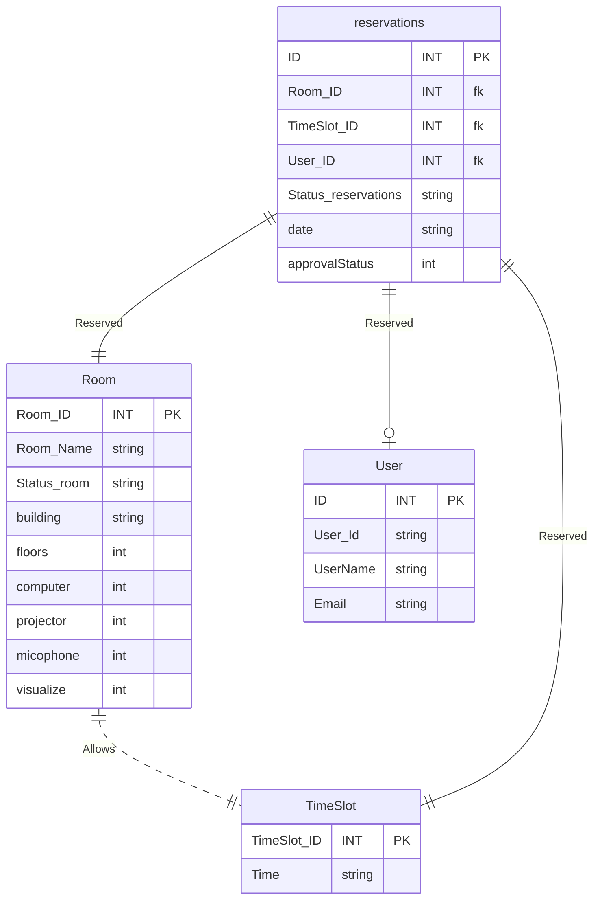

```mermaid
erDiagram
    Room {
        Room_ID INT PK
        Room_Name string
        Status_room string
        building string
        floors int
        computer int
        projector int
        micophone int
        visualize int
    }

    TimeSlot {
        TimeSlot_ID INT PK
        Time string
    }

    reservations {
        ID INT PK
        Room_ID INT fk
        TimeSlot_ID INT  fk
        User_ID INT fk
        Status_reservations string
        date string
        approvalStatus int
        
    
    }

    User {
        ID INT PK
        User_Id string
        UserName string
        Email string
    }

    Room ||..|| TimeSlot : Allows
    reservations ||--|| Room : Reserved 
    reservations ||--|| TimeSlot : Reserved 
    reservations ||--o| User : Reserved 


```