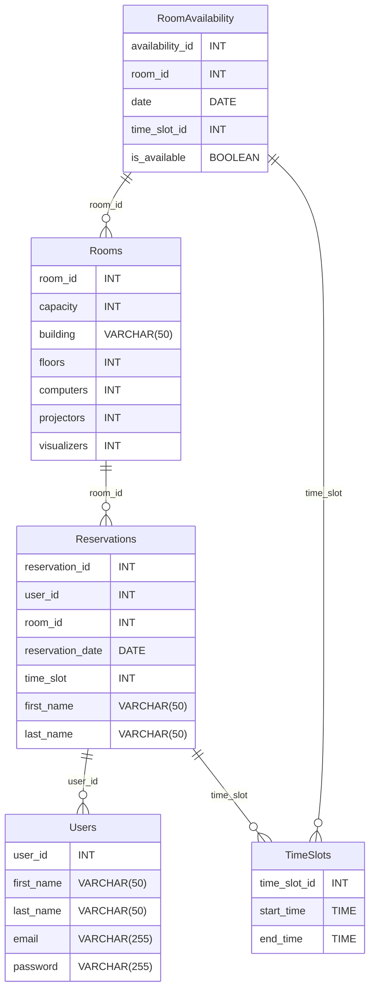

```mermaid
erDiagram
    Rooms {
        room_id INT
        capacity INT
        building VARCHAR(50)
        floors INT
        computers INT
        projectors INT
        visualizers INT
    }

    Reservations {
        reservation_id INT
        user_id INT
        room_id INT
        reservation_date DATE
        time_slot INT
        first_name VARCHAR(50)
        last_name VARCHAR(50)
    }

    TimeSlots {
        time_slot_id INT
        start_time TIME
        end_time TIME
    
    }

    RoomAvailability {
        availability_id INT
        room_id INT
        date DATE
        time_slot_id INT
        is_available BOOLEAN
    }

    Users {
        user_id INT
        first_name VARCHAR(50)
        last_name VARCHAR(50)
        email VARCHAR(255)
        password VARCHAR(255)
    }

    Rooms ||--o{ Reservations: "room_id"
    Reservations ||--o{ Users: "user_id"
    Reservations ||--o{ TimeSlots: "time_slot"
    RoomAvailability ||--o{ Rooms: "room_id"
    RoomAvailability ||--o{ TimeSlots: "time_slot"

```